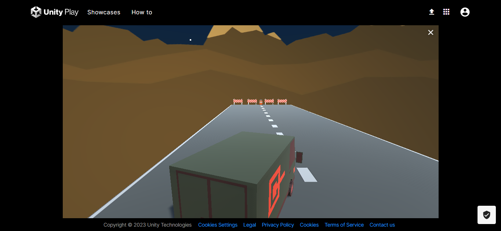

# Unity-CarGame

This is a simple car game implementation on Unity software.
Due to huge data size on `Library` subdirectory it is zipped on the corresponding directory.In order to test, firstly unzip this directory.
This is not a standard approach as usually these files are tracked using `GIT LFS`.But for ease of use I just zipped them.

### Game Play

This is [link](https://play.unity.com/mg/other/webgl-builds-324486) to a trial interaction.

In order to use, open the above link and play with key arrows to move the van car in the road.
